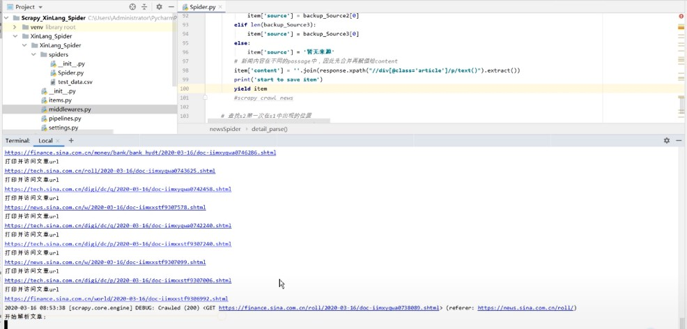
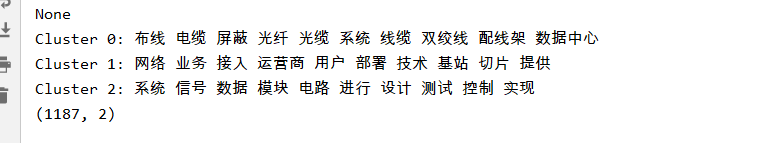

# 新浪新闻挖掘分析

## 环境

* Python3
* PyCharm 2019.3.3 x64
* scikit-learn

## 使用说明

本项目主要包含三个部分，即scrapy爬虫框架、[reload.py](reload.py)聚类文本分析、[UI.py](UI.py)聚类效果可视化。

### 爬虫部分

在项目目录打开控制台输入`scrapy crawl spider_name`，即可运行scrapy爬虫，自动采集数据集。

效果如下图所示

### 聚类分析部分

在当前目录控制台输入`python reload.py`，即可自动读取爬好的数据进行分析工作。这部分处理的思路是先将文章的文本分词，随后读取常用停用词表去停用词。根据处理好的此表生成词向量并计算TF-IDF值评估各个词向量，并采用Kmeans聚类分析效果（3类），每个聚类提取十个主题词效果如下图

最终采用PCA将高维数据降到两位，并保存生成的图片。

### UI界面部分

采用TKinter库显示聚类效果以及打印部分爬取得新闻信息，效果如下图

